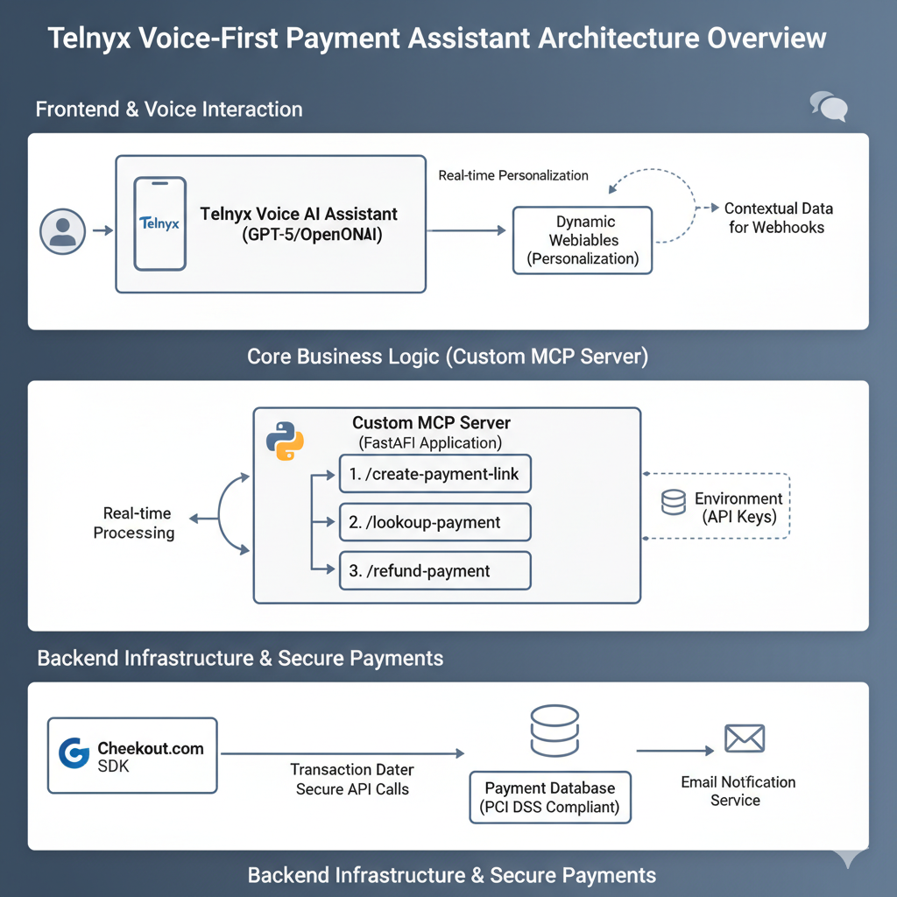

# Payment AI Assistant : Tenlyx <> Checkout.com

## Quick local run
1. create a `.env` from `.env.example` and fill keys.
2. python -m venv .venv
3. source .venv/bin/activate
4. pip install -r requirements.txt
5. uvicorn checkout_api:app --reload --host 0.0.0.0 --port 5000

## Endpoints
- GET /health
- GET /create-payment-link?amount=100&currency=USD&email=you@ex.com&phone_number=9715...
- GET /lookup-payment?payment_id=<id>
- GET /refund-payment?payment_id=<id>
- POST /get-user-context  (Telnyx dynamic webhook expects JSON payload)

## Deployment
This repo is intended to be deployed from GitHub to Railway. Set `CKO_SECRET_KEY` and `CKO_PUBLIC_KEY` in Railway environment variables before deploy.

